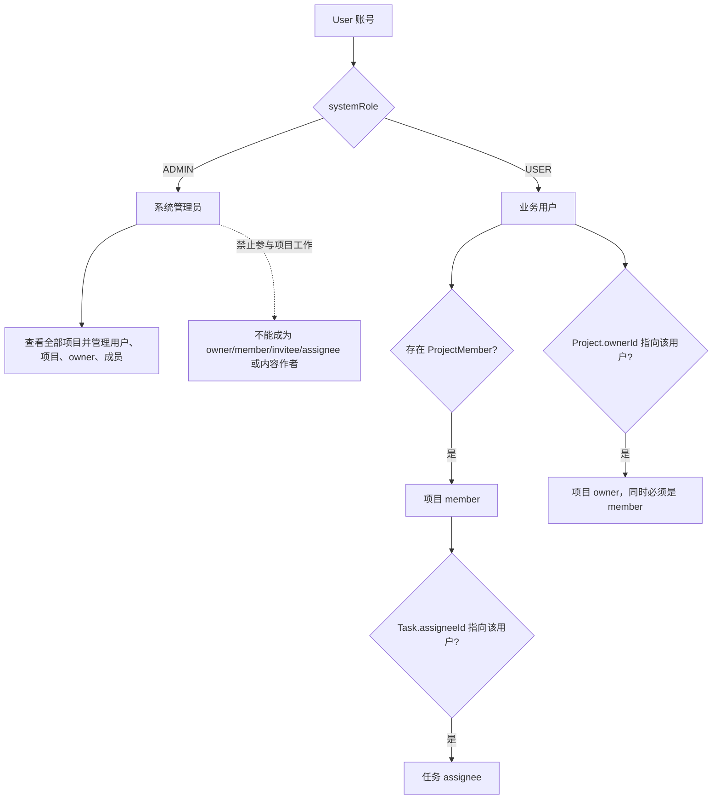
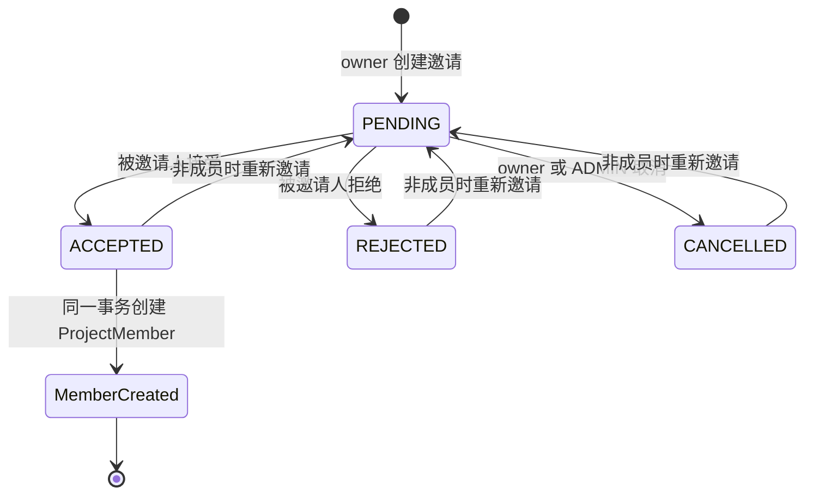
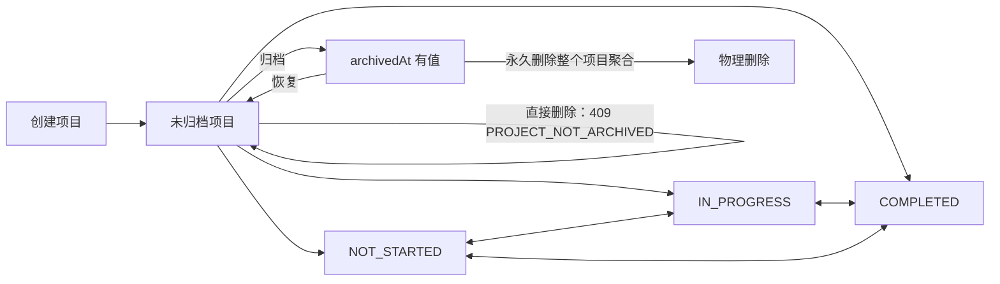
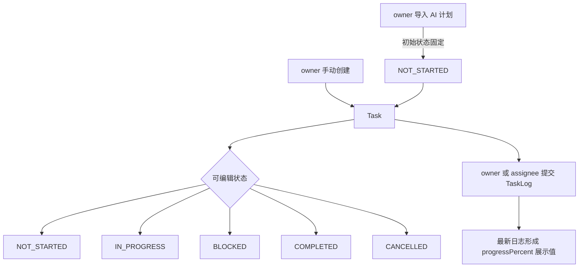
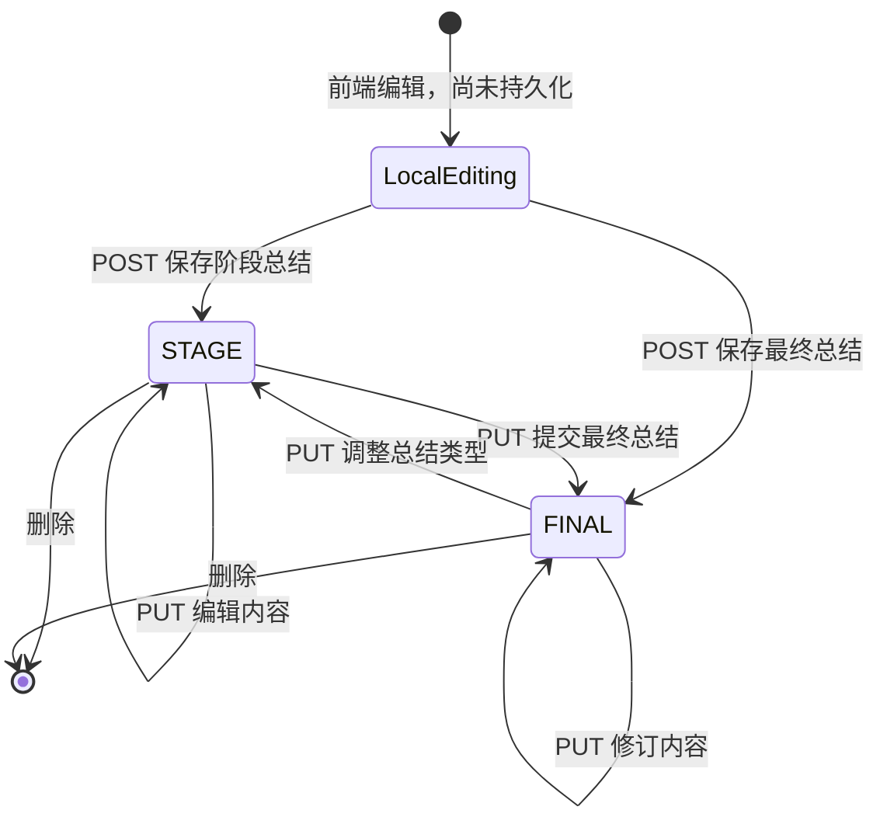
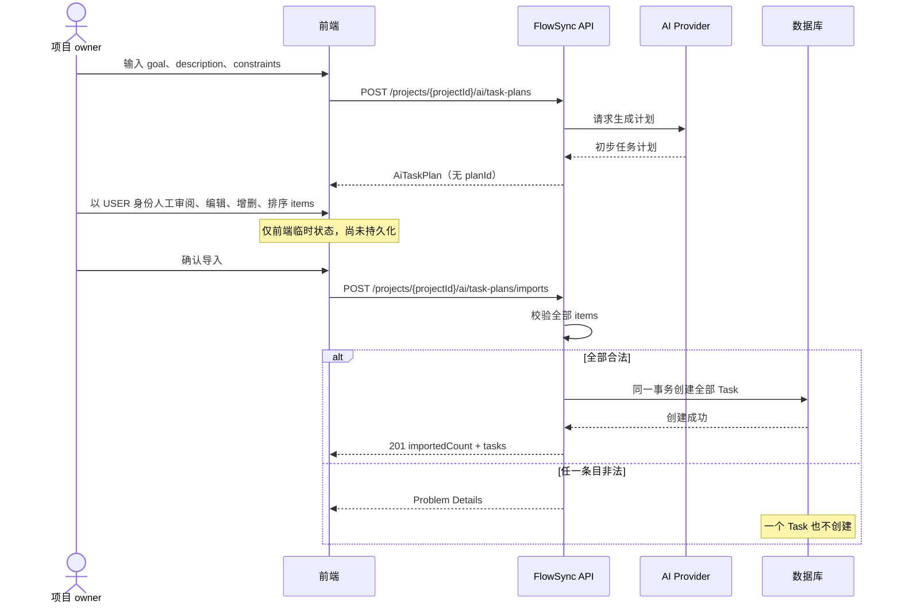
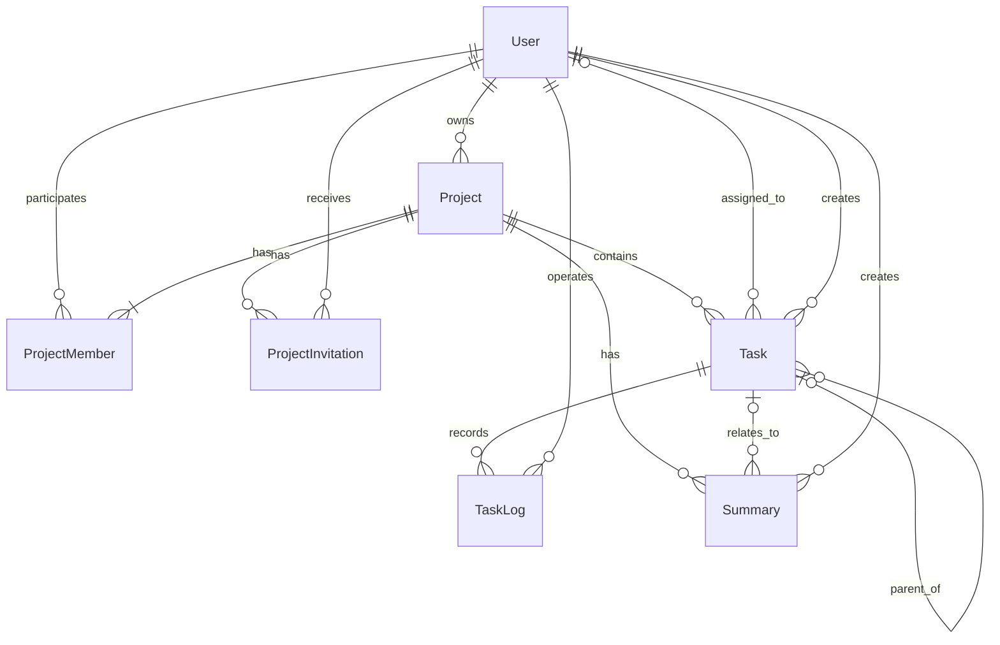

# FlowSync 业务流程详解

本文档基于 `docs/api.md` 和 `docs/relationship.md`，用于说明 FlowSync 的角色边界、
项目协作规则以及 Project、Task、Summary 和 AI 任务计划的完整流程。

若本文档与上述两份契约不一致，以 `docs/api.md` 和 `docs/relationship.md` 为准。

## 1. 角色与身份

FlowSync 的权限分为三个维度。系统角色决定账号的系统级能力；项目角色决定用户在
特定项目中的权限；任务负责人表示用户对某个任务承担执行责任。三者不能混为一个字段。

| 维度 | 角色 | 数据来源 | 主要含义 |
| --- | --- | --- | --- |
| 系统 | `ADMIN` | `User.systemRole` | 系统管理账号，可查看全部项目并管理用户、项目、owner 和成员 |
| 系统 | `USER` | `User.systemRole` | 业务账号，可以创建、拥有、参与项目并承担任务 |
| 项目 | owner | `Project.ownerId` | 项目负责人，负责项目、成员邀请、任务和项目内容管理 |
| 项目 | member | `ProjectMember` | 项目参与者，可以查看项目内容、任务和日志，并创建总结 |
| 任务 | assignee | `Task.assigneeId` | 当前任务负责人，可以更新状态、提交日志并请求任务 AI 建议 |

### 1.1 ADMIN

`ADMIN` 是独立的系统管理账号，只用于系统管理：

- 可以管理用户，查看全部项目、任务、日志和总结。
- 可以创建项目，但必须指定一个有效的 `USER` 作为 owner。
- 可以修改、归档、恢复和管理项目，也可以转移 owner 或永久删除已归档项目。
- 可以把有效 `USER` 直接加入项目，或移除符合条件的成员。
- 不能成为项目 owner、member、被邀请人或 task assignee。
- 不能创建任务、任务日志或总结，不能调用任何 AI 接口，也不能作为项目内容作者。

管理员如果需要参与项目工作，必须另用一个 `systemRole=USER` 的账号。

系统必须始终保留至少一个 `active=true` 的 `ADMIN`。密码重置或账号停用后，目标用户
已有 Session 必须全部失效。

### 1.2 USER、owner 与 member

- 普通 `USER` 创建项目后自动成为 owner。
- owner 必须同时存在于该项目的 `ProjectMember` 中。
- owner 是项目级角色，不是 `User.systemRole` 的取值。
- owner 转移后，原 owner 默认保留普通 member 身份。
- member 只能看到自己参与项目的业务数据。
- 普通 member 可以创建项目级或任务级 Summary，但不能管理项目或创建、修改任务；owner
  因为同时是 member，仍拥有前述 owner 权限。

### 1.3 assignee

- assignee 可以为空，表示任务暂未分配负责人。
- assignee 必须是任务所属项目中有效且启用的 `USER` member。
- assignee 可以修改自己负责的任务状态并提交 TaskLog。
- assignee 可以请求所负责任务的 AI 建议，包括根据实际进展生成临时 TaskLog 草稿。
- assignee 不因此自动获得 owner 权限，不能修改任务的其他字段。
- 用户仍负责未完成任务时不能被停用，也不能从对应项目中移除。

### 1.4 角色关系

## 2. 项目成员管理与邀请

成员加入项目有两条合法路径，不能互相替代。

### 2.1 ADMIN 直接添加成员

1. ADMIN 调用 `POST /projects/{projectId}/members`，提交 `userIds`。
2. 后端先校验全部用户均为启用的 `USER`、没有重复且尚不是成员。
3. 全部校验通过后，一次性创建 `ProjectMember`。
4. 如果某用户有待处理邀请，直接添加成功后将邀请改为 `CANCELLED`。
5. 任意一项失败时整批回滚，不能部分添加。

owner 即使也是项目负责人，也不能调用此接口直接添加成员。

### 2.2 owner 邀请 USER

1. owner 调用 `POST /projects/{projectId}/invitations`，可批量邀请有效 `USER`。
2. 被邀请人必须启用、尚未加入项目，且不能已有 `PENDING` 邀请。
3. 系统创建状态为 `PENDING` 的 `ProjectInvitation`。
4. 只有被邀请人本人可以通过 `PUT /project-invitations/{invitationId}` 接受或拒绝。
5. 接受时，在同一事务内把邀请更新为 `ACCEPTED` 并创建 `ProjectMember`。
6. owner 或 ADMIN 可以取消 `PENDING` 邀请；取消是改为 `CANCELLED`，不删除历史记录。

批量邀请必须先校验全部用户再写入，任意一个用户不符合条件时整批不生效。

### 2.3 移除成员和转移 owner

- owner 或 ADMIN 可以移除普通成员。
- 当前 owner 不能被直接移除；必须先转移 owner。
- 成员仍负责该项目的未完成任务时不能移除，应先完成、取消或重新分配任务。
- 转移 owner 时，目标必须是启用的 `USER`；若目标还不是 member，后端在同一事务中
  自动创建成员关系。

## 3. Project 生命周期

### 3.1 创建

- `USER` 创建项目：请求中的 `ownerId` 为 `null`，当前用户自动成为 owner。
- `ADMIN` 创建项目：必须指定启用的 `USER` 作为 `ownerId`。
- 创建 Project 和把 owner 加入 `ProjectMember` 必须在同一事务中完成。
- 项目日期同时存在时，`endDate >= startDate`。

### 3.2 执行与状态

项目业务状态只有：

- `NOT_STARTED`：尚未开始。
- `IN_PROGRESS`：进行中。
- `COMPLETED`：已完成。

owner 或 ADMIN 使用 `PUT /projects/{projectId}` 完整更新项目。契约没有限定固定的状态
转换顺序，因此这些状态是可编辑的业务状态，不应额外实现未约定的状态机限制。

项目执行期间可以进行以下操作：

- owner 邀请成员，ADMIN 直接添加成员。
- owner 或 ADMIN 管理成员、邀请、项目信息和 owner。
- owner 创建和管理任务，member 查看项目内容并创建总结。
- owner 或当前 assignee 可以请求对应任务的 AI 建议。
- 只有 owner 可以生成、编辑并导入临时 AI 任务计划。

### 3.3 归档与恢复

归档通过 `archivedAt` 表示，不是新的 `ProjectStatus`：

- `archivedAt=null`：未归档。
- `archivedAt!=null`：已归档。

已归档项目保留全部历史数据，但不能继续新增成员、邀请、任务或修改业务数据。owner 或
ADMIN 可以恢复项目，恢复时清空 `archivedAt`。

### 3.4 删除

owner 或 ADMIN 只能永久删除已经归档的项目。未归档项目调用
`DELETE /projects/{projectId}` 时返回 `409 PROJECT_NOT_ARCHIVED`；必须先调用归档接口，
再单独确认永久删除。删除操作不可撤销，后端必须在同一事务内删除项目的 Summary、
TaskLog、Task、ProjectInvitation、ProjectMember 和 Project；任一步失败时整体回滚。
删除由接口显式执行，不依赖数据库 `ON DELETE CASCADE`。

归档仍是保留历史数据的日常结束方式；永久删除只用于明确不再需要项目及其全部历史的场景。

## 4. Task 生命周期与 TaskLog

### 4.1 创建和导入

任务有两种创建方式：

1. owner 调用 `POST /tasks` 手动创建。
2. owner 确认 AI 临时计划后，调用批量导入接口创建。

手动创建可以指定任一合法 `TaskStatus`。AI 导入的任务统一以 `NOT_STARTED` 创建。
`creatorId` 始终从当前 Session 取得，不能由客户端提交。

任务可以没有 assignee，也可以通过 `parentId` 组成同一项目内的父子任务。父子关系不能
跨项目，也不能形成循环。任务截止日期必须位于项目日期范围内。

### 4.2 状态与执行

任务状态包括：

- `NOT_STARTED`：尚未开始。
- `IN_PROGRESS`：正在执行。
- `BLOCKED`：当前受阻。
- `COMPLETED`：已经完成。
- `CANCELLED`：已经取消。

owner 可以通过完整 `PUT` 修改任务的全部可编辑字段；owner 或当前 assignee 可以通过
`PUT /tasks/{taskId}/status` 只修改状态。契约没有限制状态之间的固定转换路径。

### 4.3 TaskLog 的用途

TaskLog 是任务执行过程的历史记录，每条日志保存：

- 操作人 `operatorId`，由当前 Session 取得。
- 本次记录的 `progressPercent`，范围为 0 到 100。
- 本次进展说明 `content`。
- 不可由客户端指定的创建时间 `createdAt`。

Task 返回的 `progressPercent` 不是 Task 表字段，而是由最新 TaskLog 计算的展示字段；没有
日志时为 `0`。TaskLog 用于保留阶段进展、解释当前完成度，并向项目成员和 ADMIN 提供
可追溯的执行记录。它不等同于任务状态，也不会按契约自动改变 `Task.status`。

权限规则：

- member 或 ADMIN 可以查看任务日志。
- owner 或当前 assignee 可以创建日志。
- owner 或日志创建者可以删除日志。
- owner 或当前 assignee 可以请求临时 AI 建议作为日志草稿，但必须人工审阅后仍通过
  TaskLog 创建接口提交。

### 4.4 删除任务

只有 owner 可以删除任务。存在任一子任务、TaskLog 或 Summary 时不能删除，且系统不应
隐式级联删除这些历史记录。

## 5. Summary 生命周期

`Summary` 是持久化的项目总结或任务总结，不是 AI 临时 DTO：

- `taskId=null`：项目级总结。
- `taskId` 有值：任务级总结，且任务必须属于同一项目。
- `type=STAGE`：阶段总结。
- `type=FINAL`：最终总结。

### 5.1 创建、编辑和保存

1. 项目 member 准备总结内容。
2. 调用 `POST /summaries`，提交 `projectId`、`taskId`、`type` 和 `content`。
3. 后端从 Session 写入 `createdBy` 并持久化 Summary。
4. 创建者或 owner 可使用 `PUT /summaries/{summaryId}` 完整提交 `type` 和 `content`。
5. `type` 是可编辑字段；契约未限制 `STAGE` 与 `FINAL` 的转换方向，也未把 `FINAL`
   定义为不可修改的终态。
6. 创建者或 owner 可以删除；member 和 ADMIN 可以读取自己可见项目内的总结。

当前契约没有“草稿”数据库状态。编辑保存前的内容属于前端本地状态，保存成功后才形成或
更新 Summary。ADMIN 只能读取，不能创建或编辑项目总结。

## 6. AI 功能的生命周期与流程

当前契约没有“AI 自动生成 Summary”的接口。AI 能力包括单任务建议和项目任务计划；
`Summary` 仍由 member 通过 Summary 接口保存。若以后需要 AI 总结，应先更新
`docs/api.md` 和 `docs/relationship.md`，再实现对应流程。

### 6.1 单任务建议

1. owner 或当前 task assignee 调用 `POST /ai/task-suggestions`，提交 `taskId` 和可空的
   `focus`；`focus` 可包含实际进展并要求生成 TaskLog 草稿。
2. 后端调用 AI Provider。
3. 成功返回 `suggestion` 和 `generatedAt`。
4. 返回内容不自动保存为 Task、TaskLog 或 Summary。
5. USER 必须人工审阅并可编辑建议；若作为 TaskLog 草稿，用户还必须自行确认
   `progressPercent`，再通过 `POST /tasks/{taskId}/logs` 提交。

未负责该任务的普通 member 和 ADMIN 不能调用任务建议。AI 不能自行认定实际进度，也不能
直接创建 TaskLog；最终 `operator` 始终来自提交日志时的 USER Session。

### 6.2 AI 任务计划

#### 请求阶段

owner 提交：

- 必填的 `goal`。
- 可选的 `description`。
- 可选的 `constraints.maxItems`，范围 1 到 20，默认 10。
- 可空的 `constraints.targetEndDate`，日期必须符合项目范围。

#### 返回阶段

后端返回临时 `AiTaskPlan`，包含 `overview`、`items` 和 `generatedAt`。每个 item 使用仅在
本次计划内有意义的 `draftId` 和 `parentDraftId` 表达父子关系。

#### 编辑阶段

owner 必须以 USER 身份人工审阅计划，并可以在前端修改、增加、删除或重新排序 `items`。
这些操作不会调用服务端保存，也不会写数据库。`AiTaskPlan` 没有 `planId`，刷新或离开
页面后的草稿恢复不在当前契约范围内。

#### 保存（导入）阶段

前端只提交 owner 人工审阅后最终确认的 `items`，不提交上一步的完整响应。导入请求必须
来自当前 owner 的 USER Session；AI Provider 和 ADMIN 不能代替 owner 提交。后端必须：

1. 校验数量、必填字段、临时 ID 唯一性和父子关系无环。
2. 校验 assignee 是有效项目成员，日期符合项目范围。
3. 全部校验通过后，在一个事务中创建所有 Task。
4. 把新任务状态设为 `NOT_STARTED`，creator 设为当前 owner。
5. 返回 `201`、`importedCount` 和本次创建的全部 Task。

任意条目失败时返回 Problem Details，整批回滚。

### 6.3 AI 任务计划的前端中间状态

以下状态只用于描述前端交互，不是 API 枚举，也不应持久化为数据库字段：

| 中间状态 | 含义 | 服务端是否持久化 |
| --- | --- | --- |
| 输入中 | owner 正在填写目标与约束 | 否 |
| 生成中 | 请求已发送，等待 AI 返回 | 否 |
| 生成失败 | 限流、Provider 错误或其他 Problem Details | 否 |
| 待编辑 | 已收到初步 `AiTaskPlan` | 否 |
| 编辑中 | owner 修改临时 items | 否 |
| 导入中 | 最终 items 已提交，等待事务完成 | 否 |
| 导入失败 | 校验失败或事务回滚，仍可继续编辑 | 否 |
| 已导入 | 返回的 Task 已写入数据库 | 仅 Task 持久化 |

常见 AI 错误包括 `429 RATE_LIMITED` 和 `502 AI_PROVIDER_ERROR`。客户端应保留仍在页面中的
输入或编辑内容并展示 Problem Details，但不应把失败请求当作部分成功。

### 6.4 AI Provider 集成边界

首版 Provider 集成采用 OpenAI-compatible 标准子集：Bearer Token、`/v1/chat/completions`、
纯文本 message content 和非流式响应。Provider 的 base URL、模型、超时和结构化输出能力均由
服务端配置，客户端不能提交或覆盖这些值。结构化输出模式可配置为 `none`、`json_object` 或
`json_schema`；不得在 Provider 不支持所选模式时静默降级。

后端只能向 Provider 发送完成当前请求所需的最少上下文：

- 单任务建议：Task 的 title、description、status、priority、dueDate，以及 USER 提交的 focus。
- 项目任务计划：Project 的 name、description、status、priority、startDate、endDate，以及候选
  成员的 id 和 displayName。

不得把 TaskLog 历史、Summary、用户名、email、phone、Session、Cookie 或数据库凭据放入
prompt/message content。Provider API Key 只能通过 Authorization Header 发送。用户输入按不可信
数据与系统指令明确分隔，Provider 调用不启用 tools 或 function calling。

权限和上下文读取使用短只读事务并生成不可变上下文 DTO，事务结束后才调用 Provider。任何数据库
事务或 `FOR UPDATE` 锁都不能跨越 Provider I/O。生成结果是临时 DTO；导入 Task 或提交 TaskLog 时
仍通过正常业务接口重新校验权限和业务状态。

Provider 响应在完整反序列化前执行可配置的字节上限检查。任务计划只接受纯 JSON，或在
`response_format=none` 时接受单个 Markdown JSON 代码块；不得从混合自然语言中猜测 JSON，也不得
自动截断、去重、补默认值或修复业务非法条目。任一字段、父子关系、日期或 assignee 不合法时，
整份 Provider 输出按 `502 AI_PROVIDER_ERROR` 处理。`generatedAt` 使用后端完成解析和校验后的 UTC
时间，不使用 Provider 时间戳。

Provider 请求首版不自动重试，避免一次用户请求产生多次不可幂等的计费推理。本服务使用可配置的
单节点并发上限保护阻塞式 Servlet 线程；无法取得许可时返回 `429 RATE_LIMITED`。Provider 的 429
同样映射为 `RATE_LIMITED`；连接失败、超时、其他 4xx/5xx、响应过大或无效输出映射为
`502 AI_PROVIDER_ERROR`。日志只能记录模型、耗时、HTTP 状态和 Provider request ID，不能记录
API Key、完整 prompt 或原始响应。

### 6.5 时间边界

数据库 `DATETIME` 使用 `Asia/Shanghai` 墙上时间。MySQL 全局默认时区和应用连接 Session 均固定为
UTC+08:00；后端创建无时区业务时间时也显式使用 `Asia/Shanghai`，不得依赖 JVM、主机或数据库的
系统默认时区。响应 DTO 在 API 边界把该墙上时间附加 `Asia/Shanghai` 后转换为 `Instant`，因此
`docs/api.md` 中的 datetime 始终以 ISO 8601 UTC `Z` 格式返回。

## 7. 跨生命周期的关键规则

### 7.1 认证与身份

- 除登录和获取 CSRF Token 外，接口均要求有效 Session。
- `POST`、`PUT`、`DELETE` 请求必须携带 CSRF Token。
- `currentUserId`、`creatorId`、`operatorId` 不能作为客户端身份凭据，身份必须来自 Session。
- 已停用用户不能登录、接收邀请、加入项目或被分配新任务。
- AI Provider 不是系统用户，不能直接提交项目内容；AI 输出必须由具有对应权限的 USER
  人工审阅，需要进入业务记录的内容必须由该 USER 通过正常业务接口提交。

### 7.2 完整更新与校验

- 资源更新使用 `PUT`，必须发送接口列出的全部可编辑字段。
- 可空字段无值时显式发送 `null`；不可空字段缺失或为 `null` 时返回校验错误。
- JSON ID 使用字符串，字段使用 camelCase，枚举值必须与 API 契约完全一致。
- 错误统一返回 RFC 9457 Problem Details。

### 7.3 错误响应边界

- Controller、参数绑定、路由和内容协商产生的 Spring MVC 错误统一补充稳定 `code` 和
  `errors`，不得直接返回 Spring 默认错误体。
- Spring Security 在过滤器链产生的未认证、无权限和 CSRF 错误使用同一 Problem Details
  结构。
- 业务服务使用 `BusinessException` 携带已经写入 `docs/api.md` 的稳定错误码；未知异常只向
  客户端返回 `500 INTERNAL_SERVER_ERROR`，不暴露内部异常消息。
- 在请求进入 Spring MVC 之前由 Servlet 容器拒绝的非法 HTTP 请求，以及响应已经提交后的
  流式传输错误，当前无法由 ControllerAdvice 重写，处理边界记录在 `backend/TODO.md`。

### 7.4 事务边界

以下操作必须保证原子性：

- 创建项目并把 owner 加入成员。
- owner 转移以及必要的成员创建。
- 接受邀请并创建成员关系。
- 批量添加成员、批量邀请和批量导入 AI 任务。

批量操作必须先校验全部元素再写入；错误字段应包含元素下标，例如 `userIds[1]` 或
`items[2].title`。

### 7.5 历史数据保护

- User 通过 `active=false` 停用，不物理删除。
- Project 必须先归档才能删除；只有项目删除接口会显式、事务性地删除整个项目聚合。
- 有子任务、TaskLog 或 Summary 的 Task 不能删除。
- 外键默认使用 `ON DELETE RESTRICT`。

## 8. 核心对象关系

AI 的 `AiTaskPlan` 不在关系图中，因为它是前端编辑的临时 DTO，不是持久化实体。
