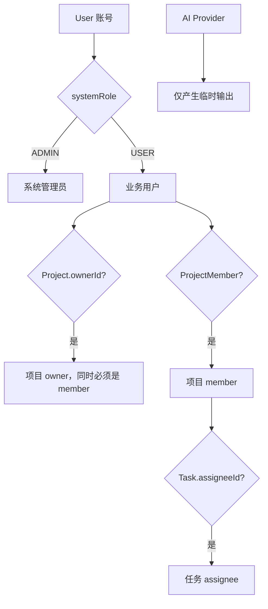
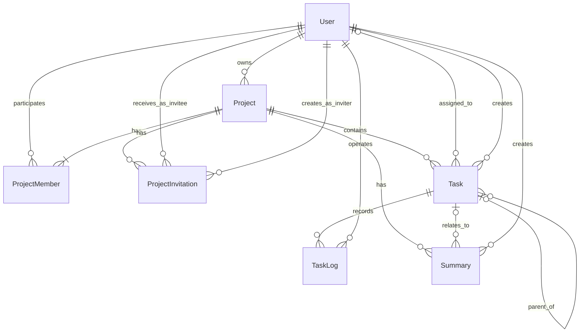
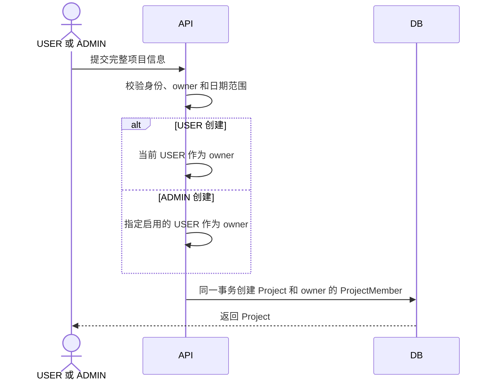
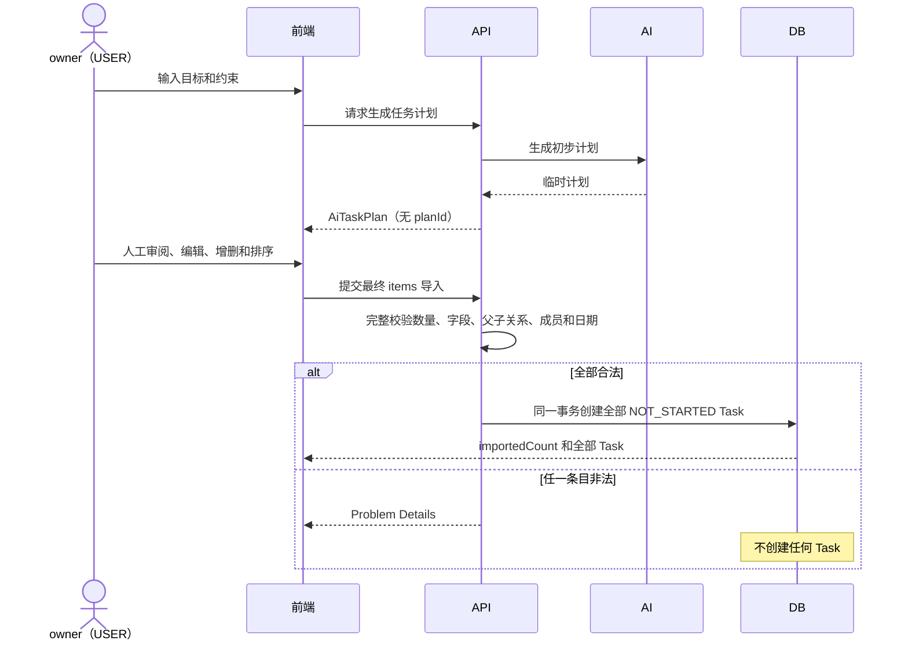
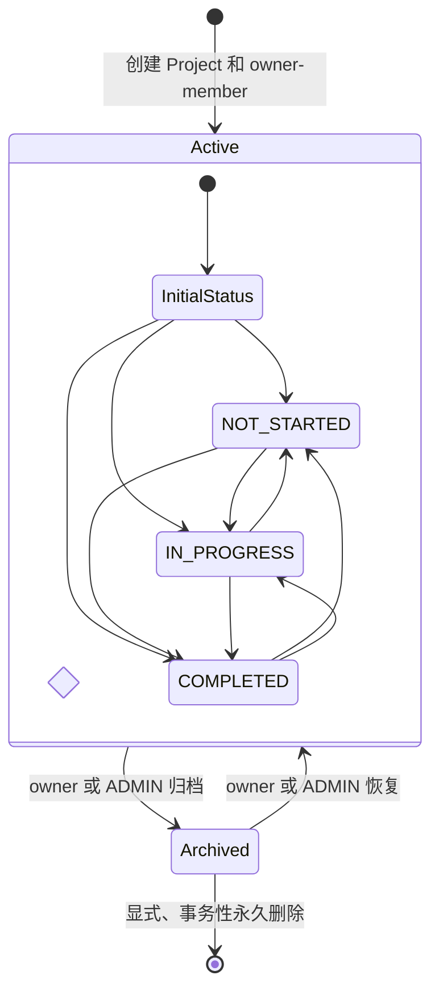
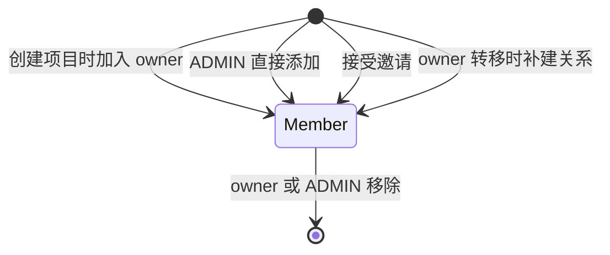
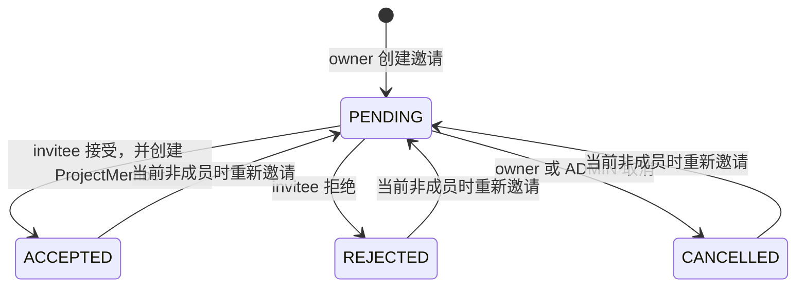
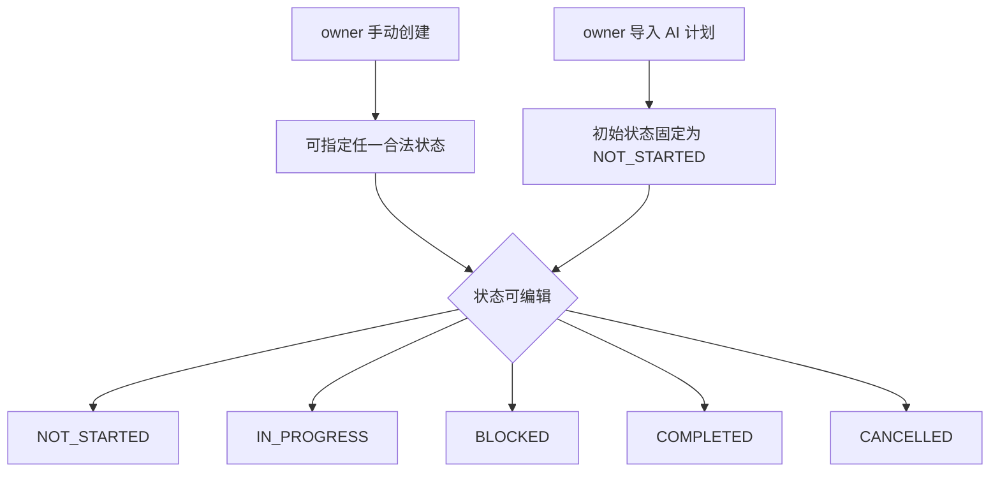
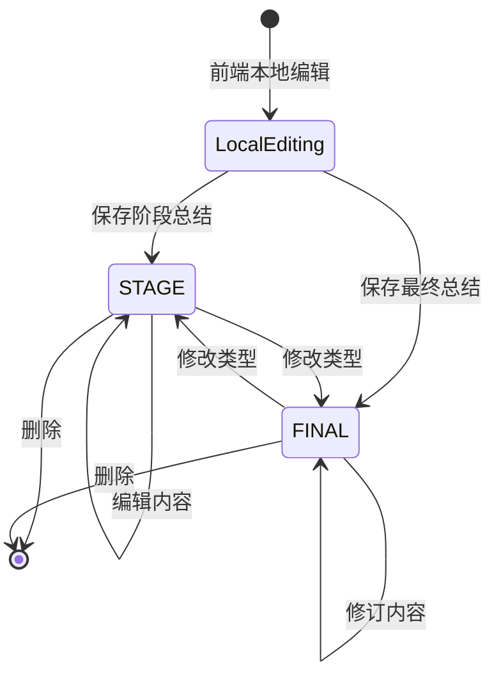

# FlowSync 业务领域模型与工作流总览

本文从业务视角总结 FlowSync 的参与者、角色权限、核心实体、实体关系、关键交互、业务规则和状态机。
详细 HTTP 契约以 [`api.md`](api.md) 为准，持久化模型及约束以
[`relationship.md`](relationship.md) 为准；本文不引入新的业务规则。

## 1. 领域边界与核心目标

FlowSync 是一个以**项目协作和任务执行**为核心的系统：

- 系统管理员维护账号和全局项目治理，但不参与具体项目工作。
- 业务用户通过项目建立协作关系，在项目内承担 owner、member、assignee 等上下文角色。
- owner 负责项目、人员邀请和任务管理；成员执行任务、记录进展并沉淀总结。
- AI 只提供临时建议和任务计划，不拥有业务身份，也不能直接修改业务数据。
- 项目是主要业务聚合边界；归档用于保留历史，永久删除则显式删除整个项目聚合。

权限采用三个相互独立、可以叠加的维度，而不是把所有身份放入一个角色字段：

## 2. 参与者、身份和角色

### 2.1 系统级身份

#### ADMIN

`User.systemRole=ADMIN`，是独立的系统管理账号：

- 管理用户、密码、账号启停和系统角色。
- 查看全部项目及其任务、日志和总结。
- 创建或管理项目，但创建时必须指定一个有效 `USER` 作为 owner。
- 可修改、归档、恢复项目，转移 owner，直接添加或移除成员，以及永久删除已归档项目。
- 不能成为 owner、member、invitee 或 assignee。
- 不能以 ADMIN 身份创建任务、日志或总结，不能成为新的项目内容作者，也不能调用 AI 接口。

USER 升为 ADMIN 后，其此前以 USER 身份创建的 Task、TaskLog 和 Summary 仍保留原作者引用；
这些历史审计记录不表示该账号当前仍能参与项目或继续写入项目内容。

管理员如需参与项目工作，必须使用另一个 `systemRole=USER` 的业务账号。

#### USER

`User.systemRole=USER`，是参与业务协作的账号：

- 可以创建项目；创建后自动成为该项目 owner 和 member。
- 可以被邀请或由 ADMIN 直接加入项目。
- 可以在不同项目中分别成为 owner、member，也可以承担具体任务。
- 只能查看自己参与项目的业务数据。

### 2.2 项目级角色

#### owner

由 `Project.ownerId` 表示，不是 `User.systemRole`：

- 是项目负责人，必须同时存在于 `ProjectMember` 中。
- 管理项目信息、owner、成员邀请、任务、任务日志和总结。
- 可以归档、恢复或永久删除项目。
- owner 转移后，原 owner 默认保留普通 member 身份。

#### member

由 `ProjectMember` 表示：

- 可以查看所属项目、成员、任务、日志和总结。
- 可以创建项目级或任务级总结。
- 不能管理项目、邀请成员或完整管理任务，除非同时具有 owner 身份。

### 2.3 任务级角色

#### assignee

由 `Task.assigneeId` 表示：

- 必须是任务所属项目中启用的 `USER` member；任务也可以暂不分配负责人。
- 可以修改自己所负责任务的状态、提交 TaskLog、获取该任务的 AI 建议。
- 不会因此获得 owner 权限，不能修改任务的其他字段。

### 2.4 外部参与者

#### AI Provider

AI Provider 不是系统用户：

- 只生成临时任务建议或临时任务计划。
- 不能确认真实进度，不能成为业务记录作者，也不能直接创建 Task、TaskLog 或 Summary。
- 输出必须由有权限的 `USER` 人工审阅；只有用户通过正常业务接口提交后才能持久化。

## 3. 角色能力矩阵

owner 同时也是 member；assignee 也必须是 member，因此实际权限按角色叠加。日志或总结的
创建者权限也与当前角色叠加。

| 能力 | USER 非成员 | member | owner | assignee | ADMIN |
| --- | --- | --- | --- | --- | --- |
| 管理自己的资料和密码 | 是 | 是 | 是 | 是 | 是 |
| 管理其他用户和重置密码 | 否 | 否 | 否 | 否 | 是 |
| 查看项目及其业务数据 | 仅参与的项目 | 是 | 是 | 是 | 全部 |
| 创建项目 | 自己成为 owner | 同左 | 同左 | 同左 | 必须指定 USER owner |
| 修改项目、转移 owner | 否 | 否 | 是 | 否 | 是 |
| 归档、恢复、永久删除项目 | 否 | 否 | 是 | 否 | 是 |
| 直接添加成员 | 否 | 否 | 否 | 否 | 是 |
| 创建邀请 | 否 | 否 | 是 | 否 | 否 |
| 接受或拒绝邀请 | 仅本人收到的邀请 | 同左 | 同左 | 同左 | 否 |
| 取消邀请 | 否 | 否 | 是 | 否 | 是 |
| 移除普通成员 | 否 | 否 | 是 | 否 | 是 |
| 创建、完整修改、删除任务 | 否 | 否 | 是 | 否 | 否 |
| 修改任务状态 | 否 | 否 | 是 | 仅所负责任务 | 否 |
| 创建任务日志 | 否 | 否 | 是 | 仅所负责任务 | 否 |
| 删除任务日志 | 否 | 仅自己创建的日志 | 是 | 仅自己创建的日志 | 否 |
| 创建总结 | 否 | 是 | 是 | 作为 member 时是 | 否 |
| 修改、删除总结 | 否 | 仅自己创建的总结 | 是 | 仅自己创建的总结 | 否 |
| 获取单任务 AI 建议 | 否 | 否 | 是 | 仅所负责任务 | 否 |
| 生成、编辑、导入 AI 任务计划 | 否 | 否 | 是 | 否 | 否 |

## 4. 核心业务实体

FlowSync 只持久化以下七个核心实体：

| 实体 | 业务职责 | 关键属性 |
| --- | --- | --- |
| `User` | 登录主体及系统级身份 | `username`、`passwordHash`、`systemRole`、`active`、个人资料 |
| `Project` | 项目聚合根和协作边界 | `ownerId`、名称、执行状态、优先级、日期范围、`archivedAt` |
| `ProjectMember` | USER 与 Project 的参与关系 | `projectId`、`userId`、`joinedAt` |
| `ProjectInvitation` | owner 邀请用户加入项目的流程记录 | 项目、invitee、inviter、状态、响应时间 |
| `Task` | 项目内可分层、可分派的执行项 | 项目、父任务、负责人、创建者、状态、优先级、截止日期 |
| `TaskLog` | 任务执行过程和进度历史 | 任务、操作人、进度百分比、内容、创建时间 |
| `Summary` | 项目级或任务级的阶段/最终总结 | 项目、可选任务、创建者、类型、内容 |

`UserBrief`、项目统计、工作台总览和 `AiTaskPlan` 都是 API DTO 或计算结果，不是持久化实体。
特别是 `AiTaskPlan` 只存在于生成响应和前端编辑状态中：没有 `planId`，也没有 AI 计划表。

## 5. 实体关系与聚合边界

### 5.1 主要关系

- 一个 `USER` 可以拥有多个 Project；每个 Project 必须且只能有一个 owner。
- User 与 Project 通过 ProjectMember 构成多对多参与关系。
- owner 是 member 的严格子集：每个项目 owner 必须同时有成员关系。
- Project 可以包含多个 Invitation、Task 和 Summary。
- Task 通过 `parentId` 在同一项目内形成树或森林，禁止跨项目引用和循环。
- Task 可以有一个 assignee，也可以未分配；一个 Task 可有多条 TaskLog。
- Summary 必须属于一个 Project，并可选择关联该项目中的一个 Task。

### 5.2 项目聚合边界

Project 是聚合根。日常删除不进行隐式级联，外键默认 `ON DELETE RESTRICT`；只有永久删除已归档项目时，
系统才在一个事务中按依赖顺序显式删除：

1. Summary
2. TaskLog
3. Task
4. ProjectInvitation
5. ProjectMember
6. Project

任一步失败都必须整体回滚。

## 6. 核心业务交互与工作流

### 6.1 认证和账号管理

1. 客户端获取 CSRF Token，并使用用户名、密码登录。
2. 登录成功后，服务端通过 HttpOnly Session Cookie 维持身份。
3. 用户可查看或完整更新自己的资料，也可修改密码。
4. ADMIN 可创建、查询、更新用户以及重置密码。
5. 改密、管理员重置密码、角色变化或停用账号后，目标用户的已有 Session 全部失效。
6. 系统不存在有效 ADMIN 时，才使用环境变量引导创建首个管理员。

### 6.2 创建项目

ADMIN 只发起管理操作，不会因此成为项目成员。

### 6.3 成员加入项目

成员只有两条合法进入路径：

#### ADMIN 直接添加

1. ADMIN 批量提交用户 ID。
2. 系统先验证全部目标均为启用的 USER、无重复且尚未成为成员。
3. 全部合法后，在一个事务中创建所有 ProjectMember。
4. 目标用户若存在 PENDING 邀请，将邀请改为 CANCELLED。
5. 任一元素失败时，一个成员也不添加。

#### owner 邀请

1. owner 批量邀请尚未加入项目的启用 USER。
2. 系统完整校验后创建 PENDING Invitation。
3. 只有 invitee 本人可以接受或拒绝。
4. 接受时，在同一事务中创建 ProjectMember，并把 Invitation 改为 ACCEPTED。
5. owner 或 ADMIN 可以取消 PENDING Invitation，但保留邀请历史。

owner 不能绕过邀请流程直接添加成员。

### 6.4 owner 转移和成员退出

- owner 或 ADMIN 可把 owner 转给启用的 USER。
- 目标用户尚不是成员时，owner 转移与成员创建必须在同一事务中完成。
- 原 owner 保留普通成员身份。
- 当前 owner 不能直接移除；必须先完成 owner 转移。
- 仍负责该项目未完成任务的成员不能移除，需先完成、取消或重新分配任务。

### 6.5 任务执行和进度留痕

1. owner 手动创建任务，或审阅 AI 计划后批量导入任务。
2. owner 可完整修改任务；owner 或当前 assignee 可单独修改状态。
3. owner 或当前 assignee 提交 TaskLog，记录实际进度和说明。
4. Task 的 `progressPercent` 取最新一条日志；无日志时为 `0`。
5. 进度和任务状态相互独立：新增日志不会自动改变 `Task.status`。
6. 只有 owner 可以删除任务，且任务不能有子任务、日志或总结。

### 6.6 总结沉淀

- member 可创建项目级总结（`taskId=null`）或任务级总结。
- 任务级总结关联的 Task 必须属于同一个 Project。
- 创建者或 owner 可修改、删除总结；ADMIN 和其他可见成员只读。
- 系统没有持久化“草稿”状态；保存前的编辑内容属于前端本地状态。

### 6.7 AI 辅助

#### 单任务建议

1. owner 或当前 assignee 请求任务建议，可提供关注点或实际进展。
2. AI 返回临时文本，不写入数据库。
3. USER 人工审阅和编辑，并自行确认 `progressPercent`。
4. 需要留痕时，USER 再通过普通 TaskLog 接口提交。

#### AI 任务计划

## 7. 状态机设计

### 7.1 User：账号启用状态和系统角色

`active` 与 `systemRole` 是两个不同维度。

| 转换 | 执行者 | 前置条件和副作用 |
| --- | --- | --- |
| 创建 USER 或 ADMIN | ADMIN / 首次系统引导 | 用户名唯一，密码符合策略 |
| `active=true → false` | ADMIN | 不能导致系统无有效 ADMIN；用户不能仍为 owner 或负责未完成任务；成功后失效全部 Session |
| `active=false → true` | ADMIN | 完整更新字段并满足角色约束 |
| `USER → ADMIN` | ADMIN | 先转移名下项目、移除成员关系并处理 PENDING 邀请；历史内容作者记录保留；成功后失效 Session |
| `ADMIN → USER` | ADMIN | 必须仍保留至少一个有效 ADMIN；成功后失效 Session |
| 修改或重置密码 | 本人 / ADMIN | 密码符合策略；成功后失效该用户全部 Session |

停用使用逻辑状态，不物理删除 User。停用用户不能登录、接收邀请、加入项目或被分配新任务。

### 7.2 Project：执行状态与归档状态

Project 有两套相互独立的状态：

1. 执行状态：`NOT_STARTED`、`IN_PROGRESS`、`COMPLETED`。
2. 归档状态：`archivedAt=null` 表示未归档，非空表示已归档。

契约没有限定执行状态的固定转换顺序，因此不能擅自增加单向流转限制。归档不是新的
`ProjectStatus`，也不等于删除：

- 已归档项目保留全部历史，除恢复和永久删除外处于只读状态。
- 成员、邀请、任务、日志、总结和 AI 相关写操作均返回 `409 PROJECT_ARCHIVED`。
- 对归档项目处理邀请时，邀请必须保持原状。
- 未归档项目不能永久删除，返回 `409 PROJECT_NOT_ARCHIVED`。

### 7.3 ProjectMember：关系生命周期

创建关系时目标必须是启用的 USER。当前 owner 或仍承担未完成任务的成员不能被移除。

### 7.4 ProjectInvitation

- PENDING 只能转为 ACCEPTED、REJECTED 或 CANCELLED。
- 接受和创建成员关系必须原子完成。
- 只有 invitee 可接受或拒绝；只有 owner 或 ADMIN 可取消。
- 取消不是删除，`respondedAt` 记录处理时间。

### 7.5 Task

Task 状态包括：`NOT_STARTED`、`IN_PROGRESS`、`BLOCKED`、`COMPLETED`、`CANCELLED`。

当前契约未规定状态之间的固定转换图：owner 可通过完整更新修改状态，owner 或当前 assignee
可通过专用接口仅修改状态。`COMPLETED` 和 `CANCELLED` 也未被定义为不可逆终态。

从 `COMPLETED` 或 `CANCELLED` 重新切换到非终态时，后端会重新校验当前 assignee 必须仍为
启用的 `USER` 且仍是项目成员。若原负责人已停用、变为 ADMIN 或退出项目，owner 必须先通过
完整 PUT 清空或更换 assignee，再重新开启任务。

### 7.6 TaskLog

TaskLog 没有枚举状态，是追加式执行历史：

- owner 或当前 assignee 创建。
- owner 或日志创建者删除。
- 不提供编辑操作。
- 删除最新日志后，任务展示进度由剩余的最新日志重新决定；没有日志则为 0。

### 7.7 Summary

`FINAL` 不是不可修改的终态；契约允许 `STAGE` 和 `FINAL` 双向修改。

### 7.8 AI 任务计划的临时交互状态

以下状态只存在于前端交互，不是 API 枚举，也不持久化：

```mermaid
stateDiagram-v2
    [*] --> 输入中
    输入中 --> 生成中
    生成中 --> 待编辑: 生成成功
    生成中 --> 生成失败
    生成失败 --> 输入中: 修改或重试
    待编辑 --> 编辑中
    编辑中 --> 导入中
    导入中 --> 导入失败: 校验或事务失败
    导入失败 --> 编辑中
    导入中 --> 已导入: 全部 Task 创建成功
    已导入 --> [*]
```

只有“已导入”后的 Task 是持久化数据；导入失败不能产生部分 Task。

## 8. 关键业务规则和权限边界

### 8.1 身份与可见性

- 除登录和获取 CSRF Token 外，所有接口要求有效 Session。
- 所有写请求要求 CSRF Token。
- `currentUserId`、`creatorId`、`operatorId` 不能由客户端用来证明身份，必须来自 Session。
- USER 只能访问自己参与项目的数据；ADMIN 可读取全部项目数据。
- 对不可见资源可统一返回 404，避免泄露资源是否存在。

### 8.2 用户和角色约束

- 系统必须始终至少保留一个启用的 ADMIN。
- ADMIN 账号与当前 owner、member、invitee、assignee 及新增项目内容作者身份互斥；账号从
  USER 升为 ADMIN 后，以前产生的 Task、TaskLog 和 Summary 作者记录继续保留。
- owner、member、invitee 和 assignee 必须是符合相应条件的启用 USER。
- 用户仍为 owner 或仍负责未完成任务时不能停用。

### 8.3 项目和内容约束

- 项目起止日期同时存在时，`endDate >= startDate`。
- Task 的父任务必须属于同一项目，且不能形成循环。
- Task 的 assignee 必须是所属项目的有效成员。
- 项目日期范围存在时，Task 截止日期必须位于范围内。
- Summary 关联的 Task 必须属于同一项目。
- 已归档项目只允许恢复或永久删除，其他业务写入一律禁止。

### 8.4 更新、事务与并发边界

- 资源更新通常使用完整 `PUT`：全部可编辑字段都必须出现，可空字段无值时显式提交 `null`。
- 创建项目、转移 owner、接受邀请、批量成员、批量邀请、AI 任务导入和永久删除项目必须保证事务原子性。
- 批量操作必须先完整校验再统一写入，任意元素失败时整体回滚，并准确标识失败下标。
- 当前版本没有 `version` 字段，也不实现乐观锁。

### 8.5 历史数据保护

- User 只停用，不物理删除。
- Invitation 取消后保留历史。
- Project 先归档，只有二次明确操作才能永久删除。
- Task 存在子任务、TaskLog 或 Summary 时不能删除。
- 除项目聚合永久删除外，不进行隐式级联删除。

### 8.6 错误边界

- 错误统一使用 RFC 9457 Problem Details 和稳定业务错误码。
- 字段校验失败为 `422 VALIDATION_ERROR`；业务状态冲突通常为 409。
- 非法 JSON 返回 400；未认证返回 401；无权限返回 403。
- AI 限流和 Provider 失败分别使用 429、502，不能把失败视为部分成功。
- 未预期异常不向客户端暴露内部实现细节。

## 9. 设计要点总结

1. **系统角色与业务角色分离**：ADMIN/USER 决定系统身份，owner/member/assignee 决定具体业务上下文。
2. **Project 是聚合根**：项目承载成员、邀请、任务、日志和总结，只有永久删除项目时显式清理整个聚合。
3. **成员加入路径受控**：ADMIN 可直接添加，owner 必须邀请并由 invitee 本人接受。
4. **状态与进度分离**：Task 状态表示业务阶段，最新 TaskLog 表示展示进度，二者不自动联动。
5. **归档与执行状态分离**：`archivedAt` 控制只读生命周期，`ProjectStatus` 描述项目执行阶段。
6. **历史优先保护**：User 停用、Invitation 取消、Project 归档均优先保留历史，普通删除受引用约束。
7. **批量操作全有或全无**：成员、邀请和 AI 导入都必须完整校验并事务提交。
8. **AI 只辅助、不代行**：AI 输出始终是临时建议，最终业务写入必须由有权限的 USER 审阅并提交。
